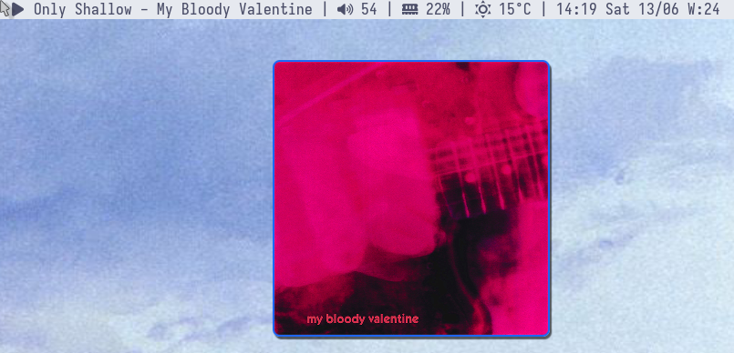

# MPD nowplaying
Just a very simple minimalistic mpd widget/player that shows album art.
### Controls:

**Q:** Quit

**P/Space/Left-click:** Toggle play/pause

**N/Double-click:** Next

**B/Right-click:** Previous

## Preview


## Building

Dependencies:
 - mpd
 - libmpdclient
 - odin

```bash
$ odin build . -build-mode:exe
```

### Installation

```bash
$ sudo make clean install
```


